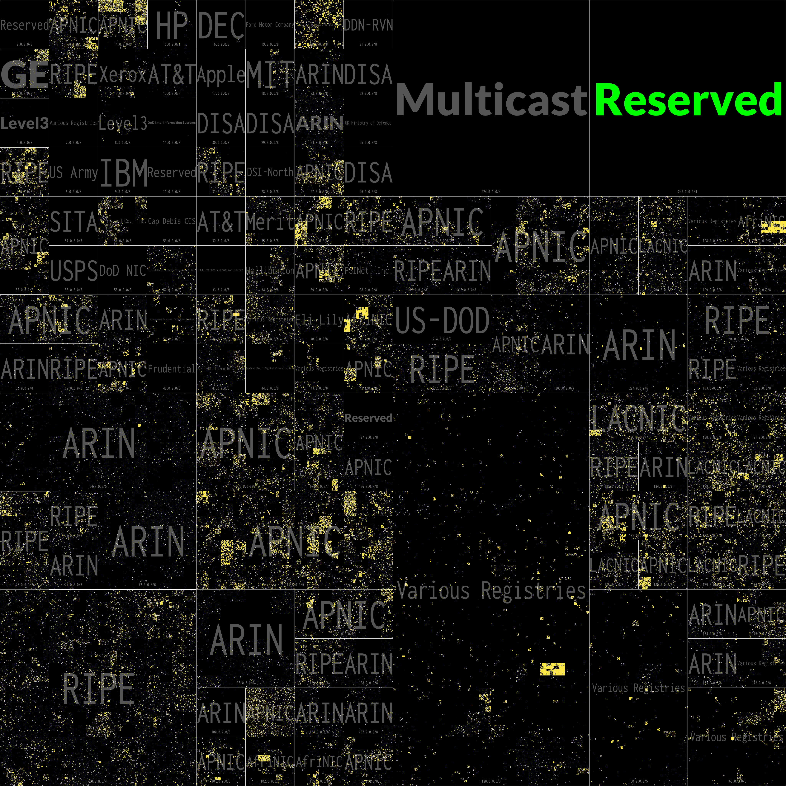

[](https://github.com/hrbrmstr/rust-ipv4heatmap/actions/workflows/rust-project-check.yml)
# Rustified IPv4 Heatmap

This is a pure Rust version of the C [ipv4-heatmap][def] utility originally published by The Measurement Factory and [updated forever-and-a-day ago by me](https://github.com/hrbrmstr/ipv4-heatmap) to add better palettes.

Differences between this and the C version(s):

- Only supports Hilbert curves (deliberate design decision)
- Only supports 4096 ✖️ 4096 full IPv4 address space heatmaps (deliberate design decision — open to debate)
- SVG separate legend file generation (see #5)
- Annotations are all in one JSON file (see below)
- Color values in annotations _require_ the RGBa transparency value; so instead of `#FFFFFF` for white, you'd use `#FFFFFFFF` (deliberate design decision)
- [Inconsolata Condensed](https://fonts.google.com/specimen/Inconsolata) is embedded in the binary, but there is support for using more fonts (see JSON explanation below)
- CIDR prefix display is at CIDR center-bottom w/fixed size (deliberate design decision — open to debate)
- Supports all Viridis palettes as well as all ColorBrewer palettes
- No support for a side/bottom "legend" and blathering area
- No animated gif support, which means no timestamps in the IPv4 input (deliberate design decision)
- No support for specifying/embedding a color in the IPv4 input (deliberate design decision)
- No support for log fill (see #4)

## One JSON To Rule All Annotations (vs Multiple TSVs)

The original `ipv4-heatmap` program had each annotation "layer" in separate TSVs. This Rust version uses a single JSON file that is an array of records which look like this:

```json
…
{
    "cidr": "4.0.0.0/8",
    "label-color": "#FFFFFFFF",
    "label": "Level3",
    "label-font": "extras/Lato-Black.ttf",
    "border-color": "#FFFFFFFF",
    "fill-color": "#FF00FF22",
    "display-prefix": true,
    "prefix-color": "#FFFFFFFF"
},
…
```

Not all fields are required, but if present:

- `fill-color` will overlay the specified color on the CIDR region
- `border-color` will draw a border around the specified color on the CIDR region
- `label`, `label-color`, and `label-font` (which is optional) will draw the specified label text to fit the CIDR region
- `display-prefix` (if present and `true`) will display the CIDR in Inconsolata at the CIDR bottom center either a default alpha'd white or a specified `prefix-color`.

in that order.

## Other Things Inside The Tin

Example heatmap & legend output are included in the repo (and displayed below). The SVG has built-in CSS that enables support (where honored) for light/dark mode.

Example JSON annotations files are included in `extras/` including updated top-level number assignments via <https://en.wikipedia.org/wiki/List_of_assigned_/8_IPv4_address_blocks>.

IANA country registry choropleth (which aligns to the colors in the second graph below).

`extras/infra-and-slash-8.json` which contains an overlay layer for orienteering in IP space (ref map `assets/infra8s.png`).

The [justfile](justfile) has some more examples.

The [generated Rust docs] have some 'splainers on the Hilbert algo.

Pre-built binaries for macOS, Windows, and Linux are in the [releases](https://github.com/hrbrmstr/rust-ipv4heatmap/releases).

## Licenses

The heatmap code is MIT licensed. Credit would be nice but not necessary.

Insonsolata was created by Raph Levien and licensed under the Open Font License.

The extra Lato font (used in the example JSON) was created by Łukasz Dziedzic and licensed under the Open Font License.

## Installation

```bash
cargo install --git https://github.com/hrbrmstr/rust-ipv4heatmap --branch batman
```

```bash
$ ipv4-heatmap
ipv4-heatmap 0.4.0
boB Rudis (@hrbrmstr)
Generate an IPv4 12th order Hilbert Heatmap from a file of IPv4 addresses.

USAGE:
    ipv4-heatmap [OPTIONS]

OPTIONS:
    -a, --annotations <ANNOTATIONS>    file containing JSON CIDR annotations
    -c, --crop <CROP>                  crop output to area represented by these CIDRs (comma
                                       separated CIDR list)
    -f, --filename <FILENAME>          input file of IPs [default: ips.txt]
    -h, --help                         Print help information
    -i, --invert                       invert the chosen color palette
    -l, --legend-file <LEGEND_FILE>    output an SVG colourbar legend to this file
    -m, --mask <MASK>                  Hilight only certain CIDRs in the heatmap image. Can be used
                                       with the "crop" argument to produce a masked and cropped
                                       heatmap image
    -o, --output <OUTPUT>              heatmap output file; extenstion determines format [default:
                                       map.png]
    -p, --palette <PALETTE>            color palette to use; one of (blues br_bg bu_gn bu_pu cividis
                                       cool gn_bu greens greys inferno magma or_rd oranges pi_yg
                                       plasma pr_gn pu_bu pu_bu_gn pu_or pu_rd purples rainbow rd_bu
                                       rd_gy rd_pu rd_yl_bu rd_yl_gn reds sinebow spectral turbo
                                       viridis warm yl_gn yl_gn_bu yl_or_br yl_or_rd) [default:
                                       cividis]
    -r, --reverse                      reverse the heatmap base (i.e. white background, black text)
    -V, --version                      Print version information
```

## Old School Assignments

```bash
$ ipv4-heatmap --filename extras/ips.txt \
	--annotations extras/iana.json \
	--invert \
	--legend-file extras/legend.svg
```




## Modern/Boring Assignments

```bash
$ ipv4-heatmap --filename extras/ips.txt \
	--annotations extras/iana-modern.json \
	--invert \
	--legend-file assets/legend.svg
```


# Cropping to CIDRs:

The crop below is cropping `assets/map.png` (Old School Assignments full image) to the CIDR range: `0.0.0.0/8,33.0.0.0/8`:

```bash
$ ipv4-heatmap --filename extras/ips.txt \
	--output assets/post-crop2.png \
	--annotations extras/iana.json \
	--invert \
	--crop 0.0.0.0/8,33.0.0.0/8
```


## Masking/Highlighting

We can use the `mask` option to focus the visualization on a given set of CIDRs to show their contribution to internet noise. This shows RIPE's contribution of garbage:

```bash
$ ipv4-heatmap --palette magma --invert \
	--filename extras/ips.txt --annotations extras/mask-labels.json --output assets/mask.png 
	--mask 109.0.0.0/8,141.0.0.0/8,145.0.0.0/8,151.0.0.0/8,176.0.0.0/8,178.0.0.0/8,185.0.0.0/8,188.0.0.0/8,193.0.0.0/8,194.0.0.0/8,195.0.0.0/8,2.0.0.0/8,212.0.0.0/8,213.0.0.0/8,217.0.0.0/8,31.0.0.0/8,37.0.0.0/8,46.0.0.0/8,5.0.0.0/8,51.0.0.0/8,57.0.0.0/8,62.0.0.0/8,77.0.0.0/8,78.0.0.0/8,79.0.0.0/8,80.0.0.0/8,81.0.0.0/8,82.0.0.0/8,83.0.0.0/8,84.0.0.0/8,85.0.0.0/8,86.0.0.0/8,87.0.0.0/8,88.0.0.0/8,89.0.0.0/8,90.0.0.0/8,91.0.0.0/8,92.0.0.0/8,93.0.0.0/8,94.0.0.0/8,95.0.0.0/8
```


The non-highlighted portions of the masked heatmap are transparent.
## Dependencies

SBOM: [sbom](bom.xml)


[def]: https://github.com/hrbrmstr/ipv4-heatmap
