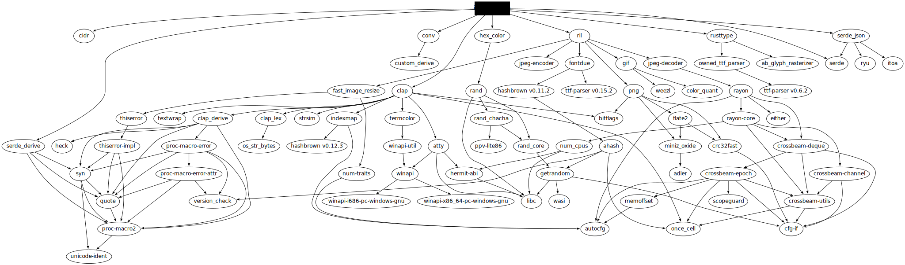

#  Rustified IPv4 Heatmap
  
  
This is a pure Rust version of the C [ipv4-heatmap][def] utility originally published by The Measurement Factory.
  
Differences between this and the C version:
  
- Only supports Hilbert curves (deliberate design decision)
- Only supports 4096 ✖️ 4096 full IPv4 address space heatmaps (deliberate design decision)
- SVG separate legend file generation (see #5)
- Annotations are all in one JSON file (see below)
- Color values in annotations _require_ the RGBa transparency value; so instead of `#FFFFFF` for white, you'd use `#FFFFFFFF` (deliberate design decision)
- [Inconsolata Condensed](https://fonts.google.com/specimen/Inconsolata ) is embedded in the binary, but there is support for using more fonts (see JSON explanation below)
- CIDR prefix display is at CIDR center-bottom w/fixed size and white-with-alpha (deliberate design decision)
- Supports all Viridis palettes as well as all ColorBrewer palettes
- No support for a side/bottom "legend" and blathering area
- No animated gif support, which means no timestamps in the IPv4 input (deliberate design decision)
- No support for specifying/embedding a color in the IPv4 input (deliberate design decision)
- No support for log fill (see #4)
  
##  One JSON vs Multiple TSVs
  
  
The original `ipv4-heatmap` program had each annotation "layer" in separate TSVs. This Rust version uses a single JSON file that is an array of records that look like this:
  
```json
…
{
    "cidr": "4.0.0.0/8",
    "label-color": "#FFFFFFFF",
    "label": "Level3",
    "label-font": "extras/Lato-Black.ttf",
    "border-color": "#FFFFFFFF",
    "fill-color": "#FF00FF22",
    "display-prefix": true
},
…
```
  
Not all fields are required, but if present:
  
- `fill-color` will overlay the specified color on the CIDR region
- `border-color` will draw a border around the specified color on the CIDR region
- `label`, `label-color`, and `label-font` (which is optional) will draw the specified label text to fit the CIDR region
- `display-prefix` will display the CIDR in Inconsolata at the CIDR bottom center w/alpha'd white (if present and `true`).
  
in that order.
  
##  Other Things Inside The Tin
  
  
Example heatmap & legend output are included in the repo (and displayed below). The SVG has built-in CSS that enables support (where honored) for light/dark mode.
  
Example JSON annotations files are included in `extras/`.
  
R code to generate the Rust palette code is included.
  
##  Licenses
  
  
The heatmap code is MIT licensed. Credit would be nice but not necessary.
  
Insonsolata was created by Raph Levien and licensed under the Open Font License.
  
The extra Lato font (used in the example JSON) was created by Łukasz Dziedzic and licensed under the Open Font License.
  
##  Installation
  
  
```bash
$ cargo install --git https://github.com/hrbrmstr/rust-ipv4heatmap
```
  
```bash
$ ipv4-heatmap
ipv4-heatmap 0.2.0
boB Rudis (@hrbrmstr)
Generate an IPv4 12th order Hilbert Heatmap from a file of IPv4 addresses.
  
USAGE:
    ipv4-heatmap [OPTIONS]
  
OPTIONS:
    -a, --annotations <ANNOTATIONS>    file containing JSON CIDR annotations
    -f, --filename <FILENAME>          input file of IPs [default: ips.txt]
    -h, --help                         Print help information
    -i, --invert                       invert the chosen color palette
    -l, --legend-file <LEGEND_FILE>    output an SVG colourbar legend to this file
    -o, --output <OUTPUT>              heatmap output file; extenstion determines format [default:
                                       map.png]
    -p, --palette <PALETTE>            color palette to use; one of (viridis magma inferno plasma
                                       cividis rocket mako turbo brbg puor rdbu rdgy rdylbu spectral
                                       bupu reds ylgnbu ylorbr ylorrd) [default: cividis]
    -r, --reverse                      reverse the heatmap base (i.e. white background, black text)
    -V, --version                      Print version information
```
  
```bash
$ ipv4-heatmap --annotations extras/iana.json --invert --legend-file extras/legend.svg
# or
# $ cargo run --release -- --annotations extras/iana.json --invert --legend-file extras/legend.svg
```
  

  

  
##  Dependencies
  
  

  
[def]: https://github.com/hrbrmstr/ipv4-heatmap
  